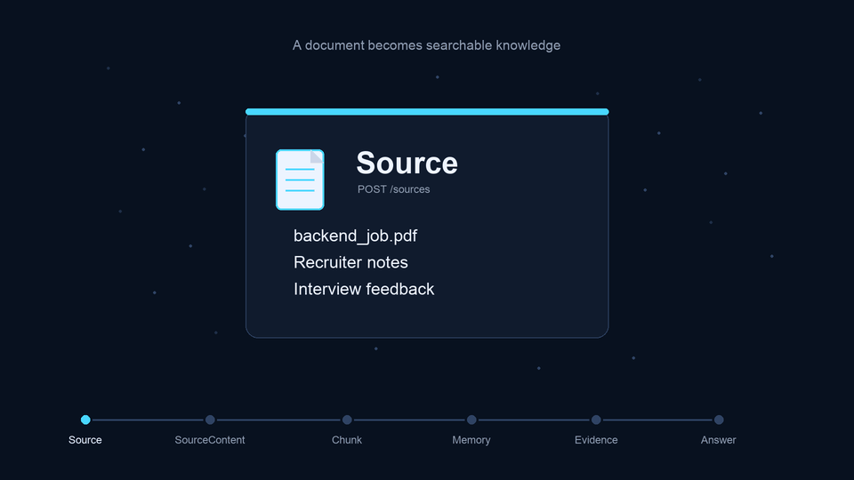
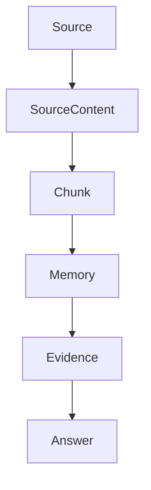

# TrampoMemo

Uma memória inteligente para quem está procurando emprego.

TrampoMemo organiza materiais de uma busca profissional e transforma documentos soltos em conhecimento consultável, rastreável e explicável.

> TrampoMemo modela o ciclo de vida do conhecimento, em vez de expor detalhes de implementação de IA.

## Demonstração



## O problema

Durante uma busca de emprego, a quantidade de informação cresce rápido.

Depois de algumas semanas, é comum ter:

- currículos em versões diferentes;
- descrições de vagas;
- conversas com recrutadores;
- feedbacks de entrevistas;
- anotações pessoais;
- informações sobre empresas;
- perguntas já respondidas em processos anteriores;
- PDFs, Markdown, textos copiados e e-mails exportados.

No começo, encontrar um documento ainda é simples.

O problema real aparece depois: encontrar uma informação específica dentro de tudo isso.

Exemplos:

- Quais empresas pediram AWS Lambda?
- Quais vagas exigiam inglês?
- Qual recrutador falou sobre trabalho remoto?
- Eu já respondi essa pergunta de entrevista antes?
- Quais entrevistas falaram sobre system design?
- Quais empresas mencionaram Docker e Kubernetes?

Busca por palavra-chave ajuda pouco quando o mesmo conceito aparece escrito de formas diferentes. `Messaging`, `RabbitMQ`, `Kafka`, `Amazon SQS` e `BullMQ` podem representar uma ideia próxima, mas uma busca tradicional trata tudo como se fossem coisas desconectadas.

## A ideia

TrampoMemo nasce de uma ideia simples:

em vez de procurar documentos, o usuário deveria consultar a própria memória da sua busca de emprego.

O projeto importa materiais heterogêneos, preserva sua origem, transforma o conteúdo em unidades menores, constrói uma memória pesquisável e responde perguntas apenas quando encontra evidências nos materiais do usuário.

O objetivo não é criar mais um chatbot.

O objetivo é mostrar como uma aplicação pode construir memória, selecionar evidências e só então gerar uma resposta.

## Como funciona



### Source

Representa qualquer material que o usuário quer que o sistema lembre.

Pode ser um currículo, uma descrição de vaga, uma conversa com recrutador, um feedback de entrevista, uma anotação pessoal, um e-mail exportado, um PDF, um Markdown ou um texto colado diretamente.

### SourceContent

É o conteúdo legível extraído de uma Source.

Essa etapa separa o ato de importar um material do ato de conseguir ler seu conteúdo. Se um PDF não puder ser extraído, isso aparece de forma explícita antes que o sistema tente construir memória a partir dele.

### Chunk

É uma unidade revisável de memória.

Chunks preservam ordem, intervalo de caracteres, relação com a Source original e, quando possível, contexto estrutural como títulos de Markdown. O objetivo é evitar tratar documentos longos como blocos opacos.

### Memory

É a representação pesquisável de um Chunk.

Memory existe independentemente de uma pergunta. Ela representa conhecimento preparado para ser encontrado depois, mas não é uma resposta e não é uma evidência por si só.

### Evidence

É o suporte específico para uma pergunta.

Evidence só existe porque o usuário perguntou algo. A aplicação procura na Memory, seleciona trechos relevantes e registra por que eles foram usados.

### Answer

É a resposta final para o usuário.

Answers são construídas a partir de Evidence, nunca diretamente de Memory. Isso mantém a resposta rastreável até os materiais originais.

## Por que este projeto existe

TrampoMemo não é apenas mais uma demonstração de RAG.

O projeto foi desenhado para ensinar uma arquitetura de memória com responsabilidades claras:

- a aplicação importa e preserva Sources;
- a aplicação extrai SourceContent;
- a aplicação cria Chunks;
- a aplicação constrói Memory;
- a aplicação seleciona Evidence;
- o provedor de linguagem apenas transforma Evidence em texto.

Embeddings, busca vetorial, recuperação semântica, provedores de IA e bancos vetoriais são mecanismos de implementação. Eles não definem a linguagem do produto.

O domínio do projeto é:

```text
Source -> SourceContent -> Chunk -> Memory -> Evidence -> Answer
```

Essa escolha deixa a arquitetura mais fácil de entender, testar, evoluir e explicar.

## Tecnologias

- Python 3.14
- FastAPI
- Pydantic v2
- SQLAlchemy 2.x
- Alembic
- PostgreSQL
- pgvector
- uv
- pytest
- Ruff
- pypdf

O projeto usa provedores determinísticos locais por padrão e também suporta provedores OpenAI para embeddings e geração de respostas. A troca acontece por configuração, sem alterar domínio, rotas ou serviços.

## Executando o projeto

### Pré-requisitos

- Python 3.14
- uv
- PostgreSQL com extensão pgvector para execução local completa

### Instalação

```bash
uv sync
cp .env.example .env
```

Edite `.env` se a sua conexão local com PostgreSQL for diferente da configuração de exemplo.

Por padrão, o projeto roda sem chaves externas:

```env
EMBEDDING_PROVIDER=local
LLM_PROVIDER=local
```

Para usar provedores OpenAI:

```env
EMBEDDING_PROVIDER=openai
LLM_PROVIDER=openai
OPENAI_API_KEY=sk-...
OPENAI_EMBEDDING_MODEL=text-embedding-3-small
OPENAI_LLM_MODEL=gpt-5.4-mini
```

Mesmo com provedores reais, a linguagem do produto não muda. O provedor gera vetores ou texto; a aplicação continua construindo Memory, Evidence e Answer.

### Migrações

```bash
uv run alembic upgrade head
```

### API local

```bash
uv run uvicorn trampomemo.main:app --reload
```

### Fluxo principal da API

1. `POST /sources`
2. `POST /sources/{source_id}/content`
3. `POST /sources/{source_id}/content/chunks`
4. `POST /sources/{source_id}/content/chunks/memory`
5. `POST /evidence`
6. `POST /answers`

Endpoints de revisão:

- `GET /sources`
- `GET /sources/{source_id}/content`
- `GET /sources/{source_id}/content/chunks`
- `GET /sources/{source_id}/content/chunks/memory`
- `GET /evidence`
- `GET /answers`

## Qualidade

O projeto prioriza comportamento determinístico, rastreabilidade e limites arquiteturais explícitos.

- `pytest` cobre o fluxo completo do MVP.
- `Ruff` mantém lint e formatação consistentes.
- `Alembic` registra a evolução do banco de dados.
- Provedores locais determinísticos permitem testar sem serviços externos.
- Provedores OpenAI permitem executar o mesmo fluxo com modelos reais em produção.
- PostgreSQL com pgvector persiste vetores e executa a busca vetorial usada para construir Evidence.
- A aplicação mantém fronteiras claras entre domínio, infraestrutura e provedores.

O armazenamento vetorial aceita dimensões diferentes por provider. Quando uma nova dimensão passa a ser usada em produção, o caminho recomendado é adicionar uma migração explícita de índice para essa dimensão, mantendo Memory como conceito de domínio e pgvector como detalhe de infraestrutura.

Verificação de qualidade:

```bash
uv run pytest
uv run ruff check .
uv run ruff format --check .
```

## Roadmap

O MVP prova o ciclo completo de memória:

```text
importar conhecimento -> construir memória -> selecionar evidências -> gerar resposta
```

Próximas evoluções possíveis:

- provedores adicionais como Gemini ou modelos locais;
- busca híbrida;
- integração com Gmail;
- integração com LinkedIn;
- OCR para PDFs escaneados;
- filtros semânticos;
- observabilidade do pipeline;
- avaliação de qualidade das respostas.

## Tópicos sugeridos para GitHub

`rag`, `ai-engineering`, `semantic-search`, `knowledge-management`, `job-search`, `fastapi`, `python`, `sqlalchemy`, `alembic`, `pytest`, `llm`, `memory-system`

## Licença

MIT License.
